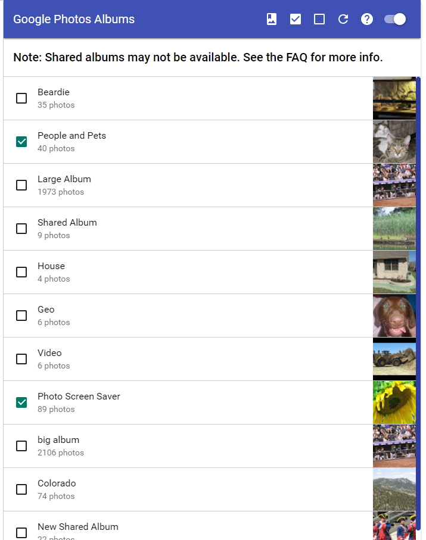
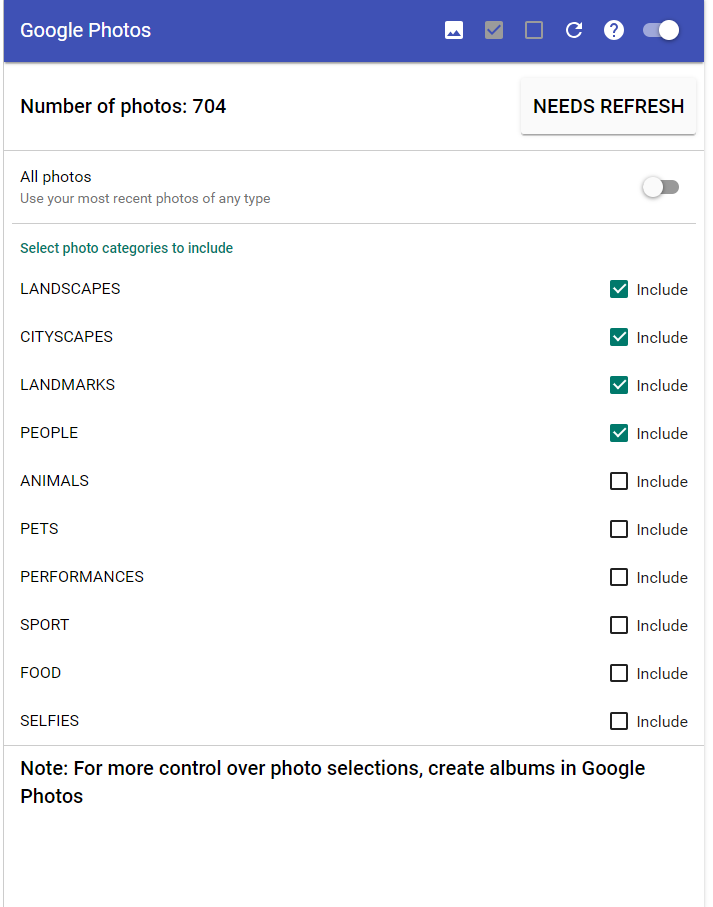

# Google Photos Page

## Album Selection Mode

This interface allows you to select one or more albums from your Google 
Photos account that will be displayed in the screensaver.
The album contents are updated daily by the extension.
Shared albums that were created by others will not be available.
Videos are not supported and are filtered out of the album.

Toolbar Icons:

Switch to photo selection mode. You will be prompted to confirm the switch,
since you will lose your current album selections.

Select the maximum number of albums. The current limit is 100. This will 
load the photos for each album up to a maximum of 2,000. This can be a lengthy operation.
There is also a maximum total number of photos that you can select. The current value
for this is 20,000.

Deselect all the currently selected albums

Refresh the list of albums from your Google Photos account. This will not reload
the photos for selected albums.

Display this Web Page.

If the toggle is off, the screensaver will not use your Google Photos and
will not update them daily, but your album selections will remain.
If you toggle it on, the screensaver will use the photos
in the selected albums and will also update the contents
of all the selected albums. This can be a lengthy operation.

Album List:

The album list allows you to toggle your selected albums on and off.
When you select an album, information about each photo will be retrieved 
from your Google Photos account. This can be a lengthy operation. If you
have added or removed photos from an album in Google Photos and wish that
to be reflected in the extension, you can deselect then reselect the album.
The extension does automatically update the contents daily.

The count for unselected albums is the total number of items in the album.
The count for selected albums is the actual number of photos the extension has
retrieved. This will differ from total count if there are videos in the
album or there are more than the maximum allowable photos per album.

## Photo Selection Mode

This interface allows you to select the most recent photos from your Google 
Photos account that will be displayed in the screensaver. The number of photos
is limited to a maximum of 3,000.
The contents are updated daily by the extension.
Videos are not supported and are filtered out of the album.

If you want more control over which photos are used, you should create
one or more albums in Google Photos and select them in the extension.

Toolbar Icons:

Switch to album selection mode. You will be prompted to confirm the switch,
since you will lose your current photo selections.

Refresh the photo selections from Google Photos. This can be a lengthy operation.

Display this Web Page.

If the toggle is off, the screensaver will not use your Google Photos and
will not update them daily, but your photo selections will remain.
If you toggle it on, the screensaver will use the photos
and will also refresh the contents from Google Photos.
This can be a lengthy operation.

