# Settings Page

## Slide Show Controls Tab

This interface allows you to configure the appearance and behavior of the screensaver.

> 

Toolbar Icons:

> 
Reset the options to their default values. This will not effect your
Google Photos selections.

> 
Display this page.

> 
If the toggle is off, the screensaver will not be displayed. Any keep awake
settings you have defined, will remain in effect.

Settings:

> 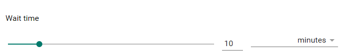

The amount of time the computer must be idle before the screensaver
will be displayed.

> 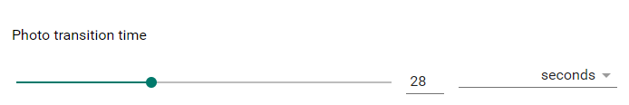

The amount of time before the next photo will be displayed.

> 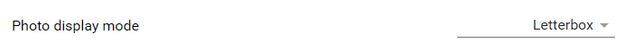

The appearance of the photo.

* Letterbox - Maintain aspect ratio
* Zoom - Fill screen, crop photo if necessary
* Frame - Maintain aspect ratio, display photo in a frame
* Full - Fill screen, modify aspect ratio if necessary
* Random - Select one of the above options each time the screensaver starts

> 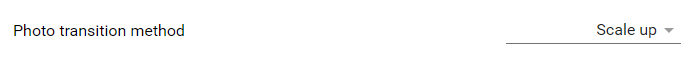

The animation to be used between photos

> 

This will give a "live" feel to the current photo by zooming and
translating while it is being displayed.

> 

Allows Chrome to startup when you log into your computer and continue to run (invisibly),
even if you close all its windows.
This will allow the extension to display the screensaver when necessary.
If you use the "Exit" command from the main Chrome menu, Chrome will
not run in the background until the next time you start it or log in to the computer.

This has no effect on Chrome OS, because Chrome always runs in the background.

There is also a global setting in Chrome that needs to be enabled for this to work.
Open the Chrome settings [chrome://settings], click on "Advanced", scroll to "System"
and make sure the setting is enabled:

> 

> 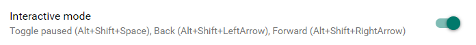

Allows you to pause and scroll through the screensaver manually. The following 
keyboard combinations are available:

* Alt++Shift+Space Bar - Toggle the slide show between paused and running.
* Alt+Shift+Right Arrow - Move forward one slide.
* Alt+Shift+Left Arrow - Move backward one slide.

You can change the key mappings that are used for this in Chrome. Open the extension
shortcuts page [chrome://extensions/shortcuts] scroll to "Photo Screen Saver"
and change the individual commands.  Don't actually type in the text for a command,
just place the cursor in the command you want to change and press the key combination
you want to use.

> 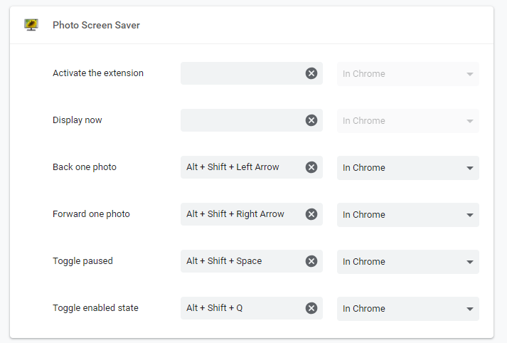

> 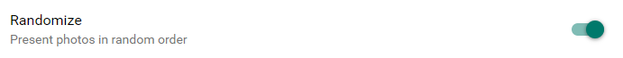

Display the photos in a random order.

> 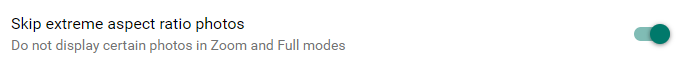

Don't show photos that are very narrow or vary wide when in Full or Zoom mode.
These photos would be highly distorted in Full mode or zoomed in on a small
portion of the photo in Zoom mode.

> 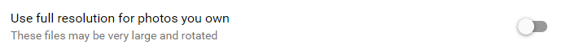

Display the highest resolution available for your Google Photos. These files
can be extremely large. Also, they have not been auto rotated in Google Photos.
If you have photos that are not oriented properly, you will need to fix that
in [Google Photos](https://support.google.com/photos/answer/6128850?co=GENIE.Platform%3DDesktop).

> 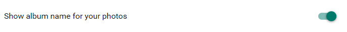

Display the album name your Google Photos are in, if you have used
[Album Mode](./google_photos.html#albums)
to select them.

> 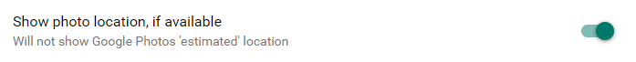

Display the geo location of a photo if it is available. Note: This feature
is not currently available.

> 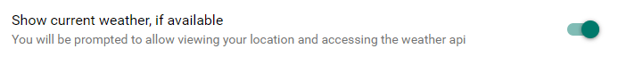

Display the current weather at your location. This will display two
dialogs, one to allow location sharing and one to authorize access to
the weather API. You must accept both of these.

There is a bug in Chrome that prevents re-displaying the dialog that
prompts you to allow location sharing if you closed it by clicking on the "X".
The only way to fix it, is to clear the cache in Chrome:

Open the Chrome settings, click on "Advanced" then "Clear Browsing data".
Make sure that "Cookies and other site data" is selected, then click
on the "Clear data" button.

> 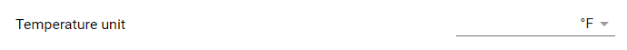

Select the format for the temperature displayed in the screensaver. The following
options are available:

* &deg;C - Celsius
* &deg;F - Fahrenheit

> 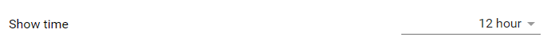

Select the format for the time displayed in the screensaver. The following
options are available:

* No - do not display the time
* 12 hour - e.g. 8:33
* 24 hour - e.g. 20:33
 
> 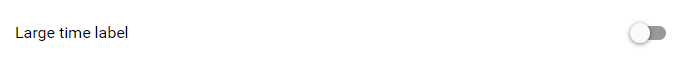

Use a larger font for the time display on the screensaver

> 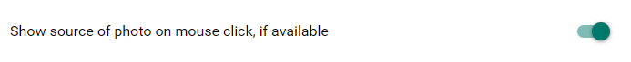

Display the original source of the currently displayed photo in the screensaver
when you click the left mouse button. You may want to turn this off if you normally
use a left mouse click to wakeup your screen.

> 

Select the background style for the screensaver. This will display a
dialog with the available styles.

## Display Controls Tab

This interface allows you to control when and where the screensaver is
displayed.

> 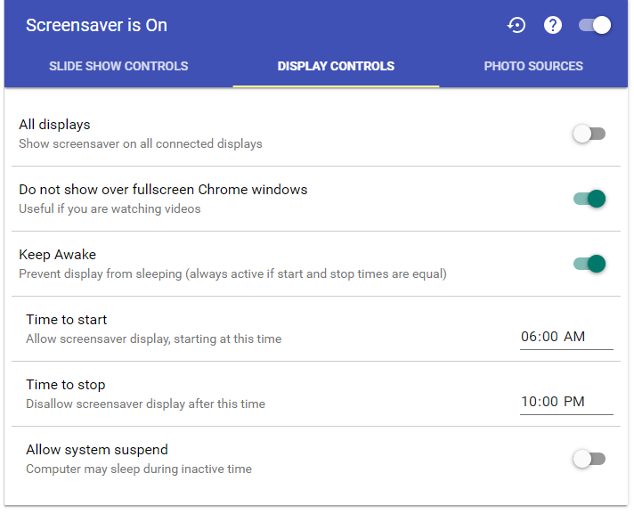

Toolbar Icons:

> 
Reset the options to their default values. This will not effect your
Google Photos selections.

> 
Display this page.

> 
If the toggle is off, the screensaver will not be displayed. Any keep awake
settings you have defined, will remain in effect.

Settings:

> 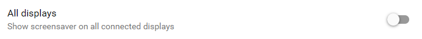

Display a screensaver on all the displays connected to this computer. This
is harder than it sounds. If it is not working as you think it should,
please [let me know](mailto:photoscreensaver%40gmail.com).

> 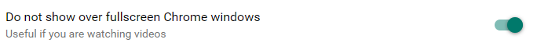

Do not display the screensaver if you have a Chrome window open that is
in full screen mode.  This is most useful if you are watching a video through
a Chrome app or web page. Unfortunately, the extension cannot detect non Chrome
full screen windows.

> 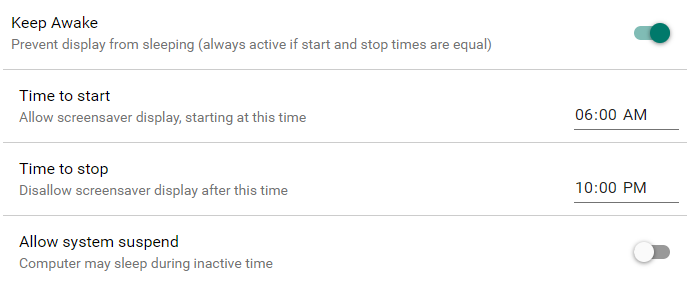

Manage when to display the screensaver and the behavior of the computer's
power settings.

If the "Keep Awake" is off, the screensaver will be displayed whenever the
computer is idle for a [certain period of time](#wait_time).

If the "Keep Awake" is on, the screensaver will only be displayed if the
current time is between the "Time to start" and "Time to stop". If the "Time to start"
and "Time to stop" are the same, the screensaver will always display. The screen
will not go to sleep during this time. If the "Allow system suspend" is on,
the computer may go to sleep.

Note: The requests to keep the screen and computer awake are only suggestions
to the operating system, and may not be honored.

## Photo Sources Tab

This interface allows you to select one or more publicly available sources
of photos for use in the screensaver.

> 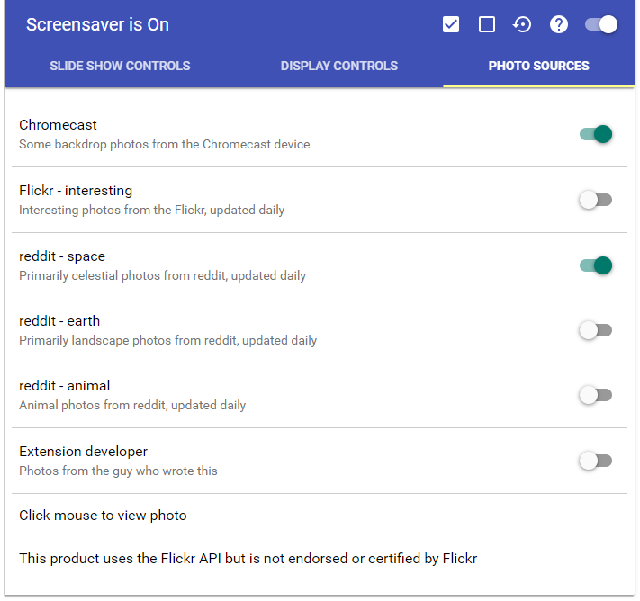

Toolbar Icons:

> 
Select all the photo sources.

> 
Deselect all the photo sources.

> 
Reset the options to their default values. This will not effect your
Google Photos selections.

> 
Display this page.

> 
If the toggle is off, the screensaver will not be displayed. Any keep awake
settings you have defined, will remain in effect.

Photo Sources:

> 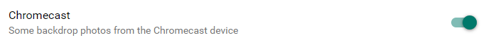

A subset of photos used by the Chromecast screensaver

> 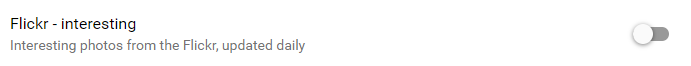

[Interesting photos from Flickr](https://www.flickr.com/explore/interesting/7days/)

> 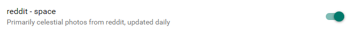

[Space photos from reddit](https://www.reddit.com/r/spaceporn/)

> 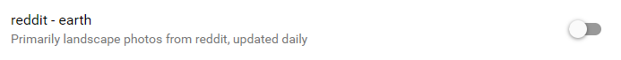

[Earth photos from reddit](https://www.reddit.com/r/earthporn/)

> 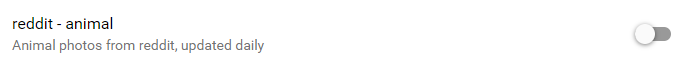

[Animal photos from reddit](https://www.reddit.com/r/animalporn/)

> 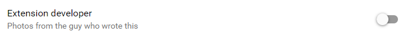

[Some of my photos (including my cats!)](https://www.flickr.com/photos/86149994@N06/)

